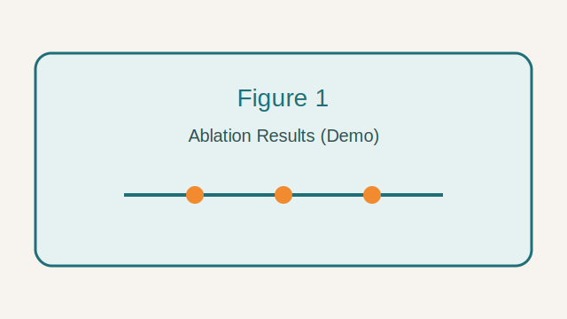
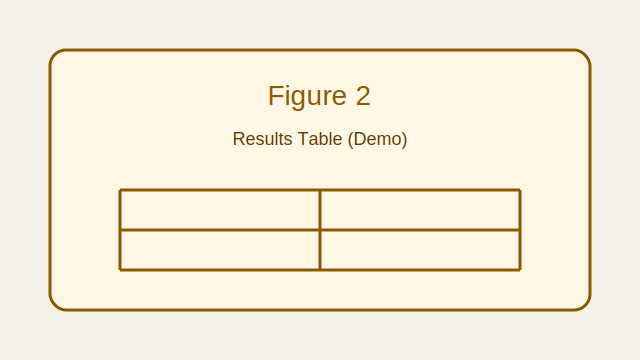

# ScholarArena Demo Paper

## Abstract
We present a compact demonstration paper used by the ScholarArena online arena demo. The method relies on evidence-gated interactions and tool-backed observations.

## 1. Introduction
The system supports multi-party review with traceable evidence. It does not replace human judgment on novelty or significance.

## 2. Method
### 2.1 Metric M
Metric M is defined as the normalized overlap between predicted and reference spans. Formally, M = |P \cap R| / |R|, where P is the predicted set and R is the reference set.

### 2.2 Evidence Gating
Each claim must cite an observation derived from the paper context. If evidence is missing, the agent must request clarification or provide a conditional commitment.

## 3. Experiments
We run ablations on three components and summarize the impact in Figure 1. The full results table is shown in Figure 2.

## 4. Discussion
We observe that removing evidence gating increases factual errors. The definition of Metric M is central to reviewer interpretation.

## References
[1] ScholarArena Demo Reference.
